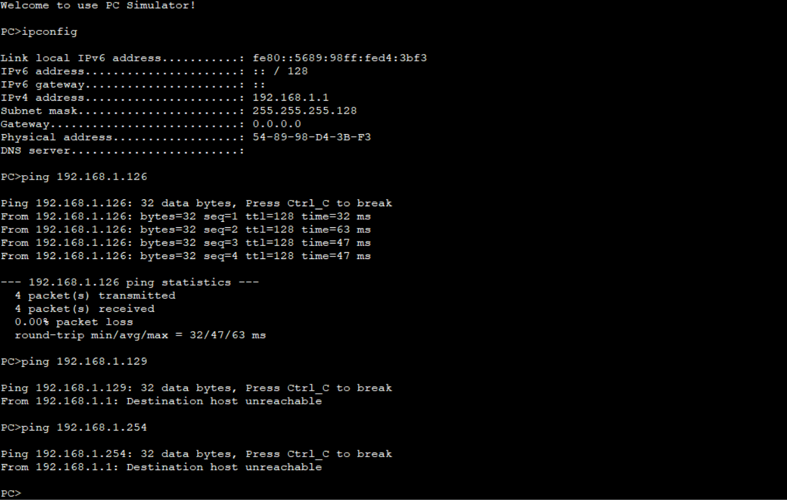
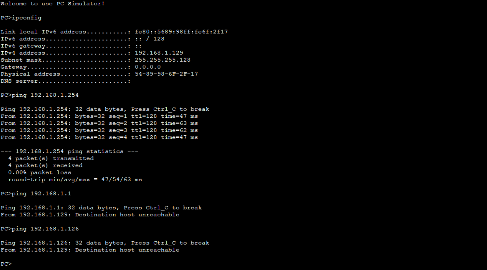

info-center source DS channel console trap state off

# 现代数据通信的核心标准架构TCP/IP模型

- 应用层

  常见协议:HTTP、FTP、DNS、SMTP、SMB、SSH

- 传输层

  常见协议:TCP、UDP

- 网络层

  常见协议:IP、ICMP、ARP、IGMP、OSPF、BGP

- 数据链路层

  常见协议:Ethernet、IEEE 802.11(WIFI)、PPP、VLAN、STP


# 常见的数据通信设备

## 数据链路层

基于MAC地址的通信

- 二层交换机
- 无线AP
- 网络扩展卡(NIC)

## 网络层

基于IP地址的通信

- 路由器
- 无线AC控制器
- 胖AP(Fat AP)
- 三层交换机

## 网络安全设备

- 防火墙


# IPv4

IPv4地址由32位二进制数组成

```bash
二进制 11000000.10101000.00000001.00000001
十进制 192.168.1.1
```

## IPv4地址的组成部分

IPv4地址由网络号(Network ID)和主机号(Host ID)组成，通过子网掩码(Subnet Mask)划分

| 类型 | 范围                        | 用途             |
| ---- | --------------------------- | ---------------- |
| A类  | 1.0.0.0 - 126.255.255.255   | 超大型网络       |
| B类  | 128.0.0.0 - 192.255.255.255 | 中型网络         |
| C类  | 192.0.0.0 - 233.255.255.255 | 小型局域网       |
| D类  | 224.0.0.0 - 239.255.255.255 | 组播             |
| E类  | 240.0.0.0 - 255.255.255.255 | 保留用于科学研究 |

## 特殊的IPv4地址

私有地址(仅用于局域网内部使用，不直接在公网上路由)

| 范围                          | 子网掩码    |
| ----------------------------- | ----------- |
| 10.0.0.0 - 10.255.255.255     | 255.0.0.0   |
| 172.16.0.0 - 172.31.255.255   | 255.240.0.0 |
| 192.168.0.0 - 192.168.255.255 | 255.255.0.0 |

环回地址(loopback): 127.0.0.1 - 127.255.255.255 255.0.0.0(用于本机Loopback网卡的地址)

APIPA地址:169.254.0.0 - 169.254.255.255(PC无法通过DHCP获取IP时自动生成的临时地址)


## 子网划分

子网划分是将一个大的网络段切分成更小的逻辑子网，以减少广播风暴，节约IP地址

核心原理:通过子网掩码(Subnet Mask)的主机号(Host ID)借位给网络号(Network ID)


例如将IP:192.168.1.0 - 192.168.1.255,子网掩码:255.255.255.0这个网络段划分为两个逻辑子网

```bash
IP十进制:11000000.10101000.00000001.00000000 - 11000000.10101000.11111111.11111111
IP二进制:192.168.1.0 - 192.168.1.255
子网掩码十进制:255.255.255.0
子网掩码二进制:11111111.11111111.11111111.00000000
子网掩码二进制缩写CIDR(无类别域间路由):24

将其划分为两个逻辑则需要将子网掩码的主机号(Host ID)向前移一位
子网掩码十进制:255.255.255.128
子网掩码二进制:11111111.11111111.11111111.10000000
子网掩码二进制缩写CIDR(无类别域间路由):25

划分后的逻辑子网范围
--------
子网1
IP十进制:192.168.1.0 - 192.168.1.127
IP二进制:11000000.10101000.00000001.00000000 - 11000000.10101000.00000001.01111111
--------
--------
子网2
IP十进制:192.168.1.128 - 192.168.1.255
IP二进制:11000000.10101000.00000001.10000000 - 11000000.10101000.00000001.11111111

```





去除掉每个逻辑子网网段的网络地址和广播地址后子网1和子网2的可用地址为126个

子网1的可用地址范围为:192.168.1.1 - 192.168.1.126 网络地址:192.168.1.0 广播地址:192.168.1.127

子网2的可用地址范围为:192.168.1.129 - 192.168.1.254 网络地址:192.168.1.128 广播地址:192.168.1.255

PS:每个网段的网络位(Network ID)全为0的地址为网络地址(用于给路由器等设备标识该网段)，主机位(Host ID)全为1的地址为广播地址(当一个数据包的目的 IP 设置为广播地址时，该网段内的所有设备都会接收并处理这个包)，所以这两种地址都不可用于分配。


# VLAN(虚拟局域网)

## VLAN的核心功能

在二层网络中，交换机的通信是依靠广播转发数据给广播域中的所有设备，这会造成大量的流量占用带宽，而VLAN技术可以将广播限制在特定的逻辑组内，防止无效流量占用带宽，提升网络性能。而不同的VLAN之间的设备在二层是无法互访的，这使得网络的安全性得到了增强。

## VLAN的划分方式

- 基于设备端口的划分

​	直接指定交换机特定的端口属于哪个VLAN ID，但是设备更改了端口则需要重新配置，配置简单，最为普遍

- 基于MAC地址的划分

  指定设备的MAC地址属于哪个VLAN，如果设备更改了端口也不需要重新配置，但是录入MAC地址的工作量巨大

- 基于协议的划分

​	根据报文所属的协议类型(如IPv4,IPv6等)划分

- 基于子网的划分

  根据数据包的源IP地址网段划分


## VLAN的核心端口模式

- Access:

  主要用于连接终端设备，只允许一个唯一的VLAN，

  发送数据:会打上该端口所属的PVID(VLAN ID) Tag，如果接收到了携带Tag的数据帧，绝大多数交换机会直接丢弃

  接收数据:检查VLAN ID是否和端口的PVID一致，如果一致则会剥离数据帧的VLAN ID Tag再进行发送，如果不一致则直接丢弃数据帧。

- Trunk:

  主要用于交换机和交换机或路由器之间的连接，允许多个VLAN ID的流量通过

  发送数据:

  ①如果该数据帧的VLAN ID在端口允许通过的列表中则发送，否则不予发送

  ②如果该数据帧的VLAN ID和端口的PVID相同则剥离Tag发送，否则保持原始标签发送

  接收数据:

  ①如果是不带Tag的数据帧，则会打上本端口的PVID,然后检查该PVID是否在允许列表中，符合则接收

  ②如果是带Tag的数据帧，则检查该数据帧的VLAN ID是否在端口的允许通过列表中，允许则接收并进行后续转发，禁止则丢弃该数据帧

- Hybrid:

  主要用于复杂场景(隔离或共享网络)，结合了Access和Trunk的优点，可自行决定哪些VLAN数据帧该发，哪些该剥离标签

  发送数据:

  ①查询Untagged列表，如果数据帧的VLAN ID在这个列表里，交换机会剥离掉Tag再发送

  ②查询Tagged列表，如果数据帧的VLAN ID在这个列表里，则保留Tag原样发送

  ③如果这两个表里都没有则直接丢弃数据帧

  接收数据:

  ①收到不带Tag的数据帧，则打上本端口的PVID Tag并检查该PVID是否在端口的允许通过列表中，在列表中则接收，不在则丢弃

  ②收到带Tag的数据帧，直接检查该数据帧的VLAN ID是否在允许通过列表中，在列表中则接收，不在则丢弃


# 生成树

## 生成树的核心功能

在有冗余链路的场景中，阻塞冗余链路消除网络中可能存在的环路，且如果活动的路径发生故障时激活冗余链路，恢复网络的连通性

## STP的基本概念

### 根桥(Root Bridge)

对于一个STP网络，根桥在全网只有一个，它是整个网络的逻辑中心(但不一定是物理中心)，根桥会根据网络拓扑的变化而动态变化。当主链路发生故障激活冗余链路时，根桥会按照一定的时间间隔产生并向外发送配置BPDU，其他设备仅对该报文进行处理，传达拓扑变化记录，从而保证拓扑的稳定。

### BID(Bridge ID)

BID由16位的Bridge优先级和BridgeMAC地址组成，BID桥优先级占据高16位(其中高4位为优先级低12位为VLAN ID)，其余的低48位是MAC地址

### PID(Port ID)

PID由高4位的端口优先级和低12位的端口号组成

### 路径开销(RPC)

交换机用来衡量一条链路好坏的度量衡，带宽速度越大，开销值越小

| 链路速率 | **IEEE 802.1t (常用标准)** | **华为私有标准 (Legacy)** | **思科 Long 模式 (32位)** | **思科 Short 模式 (16位)** |
| :------- | :------------------------- | :------------------------ | :------------------------ | :------------------------- |
| 10 Mbps  | 2,000,000                  | 2,000                     | 2,000,000                 | 100                        |
| 100 Mbps | 200,000                    | 200                       | 200,000                   | 19                         |
| 1 Gbps   | 20,000                     | 20                        | 20,000                    | 4                          |
| 10 Gbps  | 2,000                      | 2                         | 2,000                     | 2                          |
| 100 Gbps | 200                        | 1                         | 200                       | 1                          |


## 选举机制

选举分为三个关键步骤，必须按顺序进行

### 一.选举根桥(Root Bridge)

根桥是整个网络的逻辑中心，所有路径计算都以此为起点

规则:

1. 先比较BID中的优先级，优先级数值最小则胜出
2. 若优先级都相同，则比较BID中的MAC地址，最小的MAC地址则胜出

### 二.选举根端口(Root Port)

非`根桥设备`需要选举出一个距离`根桥最近的端口`，负责将数据发往根桥

规则:

1. 按照到达根桥`累计的RPC(根路径开销)之和`最小的那个端口胜出
2. 若RPC相同，则比较对端交换机的BID，最小的BID则胜出
3. 若BID也相同，则比较对端发送端口的PID，最小的PID胜出
4. 若上述均相同，则比较本地接收端口的PID，最小的胜出

### 三.选举指定端口(Designated Port,DP)

每个网段必须有一个端口负责转发根桥发来的BPDU和数据流

规则:

1. 哪个端口所在的交换机距离根桥的RPC最小，该端口就是DP
2. 若RPC相同，比较该网段连接的两台交换机的BID，BID最小者的端口为DP
3. 若BID也相同，比较该网段自身的PID，PID最小端口为DP

- 根桥上所有的端口默认为指定端口

在完成上述选举后，则整个树形拓扑建立完毕。在拓扑稳定后，只有根端口和指定端口转发流量，既不是根端口，也不是指定端口的`落选端口`将被逻辑阻塞，被逻辑阻塞的端口不会转发用户数据，只接受BPDU，直到拓扑发生变化时才可能重新启用


STP端口状态

| 端口状态   | 目的                                                      | 说明                                         |
| ---------- | --------------------------------------------------------- | -------------------------------------------- |
| Forwarding | 端口既转发用户流量也处理BPDU报文。                        | 只有根端口或指定端口才能进入Forwarding状态。 |
| Learning   | 设备会根据收到的用户流量构建MAC地址表，但不转发用户流量。 | 过渡状态，增加Learning状态防止临时环路。     |
| Listening  | 确定端口角色，将选举出根桥、根端口和指定端口。            | 过渡状态。                                   |
| Blocking   | 端口仅仅接收并处理BPDU，不转发用户流量。                  | 阻塞端口的最终状态。                         |
| Disabled   | 端口不仅不处理BPDU报文，也不转发用户流量。                | 端口状态为Down。                             |


MSTP端口状态

| 端口状态   | 说明                                                         |
| ---------- | ------------------------------------------------------------ |
| Forwarding | 在这种状态下，端口既转发用户流量又处理BPDU报文。             |
| Learning   | 这是一种过渡状态。在Learning下，交换设备会根据收到的用户流量，构建MAC地址表，但不转发用户流量，所以叫做学习状态。Learning状态的端口处理BPDU报文。 |
| Discarding | Discarding状态的端口只接收BPDU报文。                         |


# 路由

## 路由的核心功能

路由是网络中数据包从源端发送至目的端所经过的路径选择过程,其本质是三层网络设备根据特定的规则在复杂的网络拓扑中为数据包寻找最优传输路径

## 关键组成部分

- 路由器:连接多个子网的硬件设备,作为网关使用。
- 路由表:路由器内部的地图,记录了去往不同网段的对应接口或下一跳地址
- 动态路由协议:计算和维护路径信息的规则,旨在基于带宽、延迟或TTL选出"最快"或"最近"的路径

## 三种主要路由类型

- 直连路由

​	给路由器的接口配置好了IP和子网掩码且接口状态为up后,路由器会自动生成通向该接口的路由。

​	直连路由只能让路由器知道直接相连的网段，如果要前往隔了另一台路由器的网段则必须依靠静态路由和动	态路由。

- 静态路由

​	需要明确指定目的端的网段，掩码以及从路由器前往目的端的下一跳或出接口。

​	由静态路由只适合简单和稳定的拓扑网络，且如果路径上的某条线路出现问题，静态路由器不会绕路，	     	数据包会被直接丢弃，除非管理员手动修改。

- 动态路由

​	路由器通过路由协议与其他路由器进行沟通，自动学习并构建路由表的过程

​	当网络出现故障时，动态路由能自动避开故障点并重新选路，无需人工干预，在大型网络中，管理员只需开	启协议，路由器会自动完成认路工作，避免手动配置的巨大工作量，且新增网络设备时，相关信息会自动在	整个网络中传播

​	

​	**常见的动态路由协议如下**

​			

| 协议名称 | 类别     | 使用场景        |
| -------- | -------- | --------------- |
| OSPF     | 内部网关 | 中大型企业内网  |
| BGP      | 外部网关 | 互联网/跨运营商 |
| RIP      | 内部网关 | 小型实验网络    |


# VLAN通信

VLAN的本质是隔离广播域,处于不同 VLAN 的设备，即使插在同一台交换机上，逻辑上也属于不同的网络，默认是无法直接通信的，要实现VLAN间的通信，必须引入路由器或三层交换机等三层网络设备进行路由转发

- 单臂路由VLAN通信方法

​	原理:路由器和交换机之间使用网线进行连接，在交换机侧配置这根网线连接的接口为trunk模式，在路由器配	置这根网线连接的接口为多个逻辑子接口，每个子接口对应一个VLAN的网关

- 三层交换机VLAN通信方法

  原理:使用带路由功能的三层交换机，为每个VLAN创建一个Vlanif接口，并在Vlanif接口上配置好IP和子网掩码。


# ACL(访问控制列表)

## 核心功能

ACL是网络设备的防火墙规则，它通过定义一系列规则，决定了哪些数据包可以放行(Permit)，那些必须丢弃(Deny)。

ACL常用于流量过滤:控制哪些用户可以访问哪些服务器。

或者用于匹配感兴趣流:在路由协议、QoS、NAT中，用ACL挑选出特定的流量进行特殊处理

## 工作原理

ACL由一系列有顺序的规则组成，当一个数据包经过了配置了ACL的接口时，则会按照规则编号进行逐条比对，一旦数据包符合某条规则，路由器就执行该规则的操作，不再看后面的规则


## ACL编号分类

| 类别          | **华为 (Huawei)** | **H3C (华三)** | **思科 (Cisco)**     | **检查内容 (核心依据)** |
| :------------ | :---------------- | :------------- | :------------------- | :---------------------- |
| **基础/标准** | 2000 - 2999       | 2000 - 2999    | 1 - 99 (及扩展段)    | 仅检查 源 IP 地址       |
| **高级/扩展** | 3000 - 3999       | 3000 - 3999    | 100 - 199 (及扩展段) | 源/目 IP、协议、端口号  |
| **二层 ACL**  | 4000 - 4999       | 4000 - 4999    | N/A (通常用 MAC ACL) | 源/目 MAC、VLAN ID      |
| **用户/命名** | 6000+ 或 命名     | 命名 ACL       | 命名 (Named) ACL     | 灵活定义，易于管理      |


## 配置三要素

1. 定义规则:写清楚`源IP`和`目的IP`,用什么协议，做什么动作

2. 通配符掩码:ACL使用反掩码(0代表必须匹配,1代表忽略)，如0.0.0.255表示匹配前三个字节

3. 应用方向:

  - Inbound:入方向，数据包进入路由器接口时检查

  - Outbound:出方向，数据包经过路由查表后，从接口发出去前检查

  基本ACL尽量靠近目的IP(因为只看源IP，放太近容易误伤其他路径)。高级ACL尽量靠近源地址(早发现早处理，节省网络            链路资源)

# AAA

## 三大核心功能

1. 认证(Authentication)

   作用:验证用户的身份

   常见手段:密码、数字证书、生物识别

2. 授权(Authorization)

   作用:根据身份分配权限，比如普通运维只能看配置(Read-only)，而管理员可以修改配置(Read-Write)

   常见手段:给不同用户下发不同的命令级别

3. 计费(Acounting)

​	作用监控并记录用户的操作行为，比如你什么时候上线的，改了哪条配置，消耗了多少流量。

​	常见用途：审计安全事故、宽带计费


## 实现方式

### 本地AAA

用户信息直接存放在路由器/交换机的内存里

优点:简单、不依赖网络。缺点:设备数量多，每台都要手动修改信息，维护繁琐

### 远程AAA

设备把认证请求发给专门的AAA服务器

优点:集中管理，更改一次信息，全网生效


# NAT网络地址转换

## 核心功能

给局域网中的私有IP转换为公网IP


## 三种转换方式

| 方案名称         | 专业术语    | 形象比喻                                                     | 适用场景                          |
| :--------------- | :---------- | :----------------------------------------------------------- | :-------------------------------- |
| 静态 NAT         | Static NAT  | 一对一：一个私网 IP 永久绑定一个公网 IP。                    | 发布内部服务器（如 Web 服务器）。 |
| 动态 NAT         | Dynamic NAT | 多对多：一堆私网 IP 轮流使用一堆公网 IP（用完归还）。        | 基本被弃用，因为还是浪费公网 IP。 |
| 网络地址端口转换 | NAPT / PAT  | 多对一：通过端口号区分不同设备（如 PC1 用 1025 端口，PC2 用 1026 端口）。 | 家庭 Wi-Fi 和企业上网             |


## 工作流程

终端访问internet时，数据包到达路由器，路由器把源地址改为自己的公网IP，并分配一个随机端口号，记录在NAT映射表里。从intelnet返回的数据包到达路由器后，路由器查表发现端口号对应的是终端，于是将目的地址改回终端的私有IP后发给终端。


# FTP

# Telnet

# DHCP

# HTTP

# DNS

# NTP

# WLAN

# PPP

# PPPOE

# SNMP

# IPV6

# SDN

# NFV
